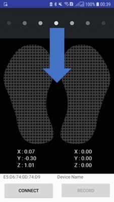

# AlfaInsole
  

  
  
## Description
  
- V1.0.0
  
AlfaInsole is a mobile application which demonstrate how establish connection with insoles. 
It also support visualize pressure data and record sensors data.
  
  
## Requirements
  
- Android deice with 5.0(API 21) or later(Bluetooth LE support)
  
- Android Studio 3.1.4(suggest, or Latest)
  
- Insole harware [AlfaOne](https://app.alfaloop.com/store/) and [NikePlus](https://app.alfaloop.com/store/)
  
  
## APK releases
  
- [V1.0.0](https://github.com/AlfaLoop/alfainsole/releases)
  
  
## Functions
  
- Insoles data real-time visualization
  
- Central pointer of foot pressure calculation and visualization  
  
- Insoles data recording
  
- Support both AlfaOne and Nike plus insole
  
  
## Gatt profile details
  
[AlfaOne.Gatt](./document/Alfaone.gatt.md) and [NikePlus.Gatt](./document/NikePlus.gatt.md)
  
  
## Screenshots
  
  
Click center of the screen or pull down to scan near devices.  
  

  

  
  
Pull down to rescan near devices.
  
  
## Thanks
  
[scwang90/SmartRefreshLayout](https://github.com/scwang90/SmartRefreshLayout)
  
  
License
-------

    Copyright 2018 menaya0506

    Licensed under the Apache License, Version 2.0 (the "License");
    you may not use this file except in compliance with the License.
    You may obtain a copy of the License at

       http://www.apache.org/licenses/LICENSE-2.0

    Unless required by applicable law or agreed to in writing, software
    distributed under the License is distributed on an "AS IS" BASIS,
    WITHOUT WARRANTIES OR CONDITIONS OF ANY KIND, either express or implied.
    See the License for the specific language governing permissions and
    limitations under the License.
  